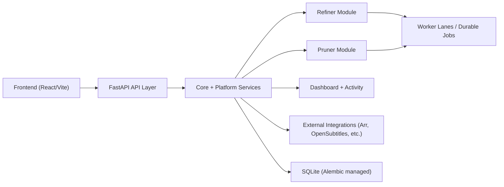

# MediaMop Architecture

This is the top-level map for agents and contributors. Deeper decisions live in [`docs/adr/`](docs/adr/).

## Product Shape

MediaMop is a self-hosted media operations app:

- **Refiner** remuxes watched media into cleaner outputs. It is configured as any number
  of **libraries** — each a row carrying its own paths, admission rules, schedule,
  guardrails and media manager connections — rather than one fixed movie scope and one
  fixed TV scope. `media_scope` survives as a property of a library because it still
  selects the cleanup behaviour, but it is no longer what the module partitions on.
  Adding a library is a POST. See
  [ADR-0014](docs/adr/ADR-0014-refiner-libraries-replace-fixed-scopes.md). The singleton
  settings rows still exist and are read only when no library covers a scope, which is a
  database that has not been migrated; they are dropped once nothing reads them.
- **Pruner** previews and removes media from connected media servers.
- **Media managers** are the products MediaMop accepts work from and reports back to.
  A connection carries a *kind* (Radarr, Sonarr, Deluno, or anything posting MediaMop's
  own payload) rather than each product having its own routes and columns; every inbound
  event arrives at `POST /api/v1/intake/webhook/{source}`. See
  [ADR-0013](docs/adr/ADR-0013-media-managers-are-kinds-not-products.md).
  Outbound, a media scope resolves to **every** connection that looks after it and each
  one is asked what it is importing and which files it still keeps. "Could not ask" is a
  distinct answer from "nothing is importing", and only the latter clears a delete. See
  [ADR-0015](docs/adr/ADR-0015-media-manager-port-outbound.md).
- **Dashboard, Activity, and Settings** expose runtime health, history, logs, backups, upgrades, and security posture.

## Runtime Shape

- Backend: FastAPI, SQLite, Alembic, Python package under `apps/backend/src/mediamop`.
- Frontend: React + Vite under `apps/web/src`.
- Packaging: Docker and Windows installer workflows.
- Runtime data: `MEDIAMOP_HOME`.

## Backend Map

- `mediamop.api`: FastAPI app factory, router composition, request dependencies.
- `mediamop.core`: config, runtime paths, database setup, lifespan, logging, schema revision checks.
- `mediamop.platform`: shared product services such as auth, activity, jobs, local browse, settings, observability, and suite settings.
- `mediamop.modules`: module-owned domains for Refiner, Pruner, and Dashboard.
- `mediamop.integrations`: external service integration code.
- `mediamop.windows`: Windows tray and package-specific helpers.

## Frontend Map

- `src/app`: app-level router and providers.
- `src/layouts`: shell/navigation layout.
- `src/pages`: feature pages by module.
- `src/lib`: API clients, query hooks, typed data helpers, and UI helpers.
- `src/components`: reusable UI and brand components.
- `src/styles`: design tokens and shell styling.
- `src/test`: frontend test setup.

## Boundary Rules

- Module code should keep destructive or irreversible behavior behind explicit services and tests.
- Backend APIs should expose typed schemas at boundaries instead of inferred shapes.
- Frontend pages should use typed API/query helpers from `src/lib` rather than ad hoc fetch calls.
- Cross-cutting runtime concerns belong in `mediamop.platform` or `mediamop.core`, not inside module implementation details.
- File lifecycle changes must preserve the safety contract in [`docs/file-lifecycle-contract.md`](docs/file-lifecycle-contract.md).

## Job Lifecycle

## Architecture Decision Records

Current ADR index: [`docs/adr/README.md`](docs/adr/README.md).

Add an ADR when a decision changes module ownership, runtime storage, data safety, security boundaries, release mechanics, or packaging behavior.
