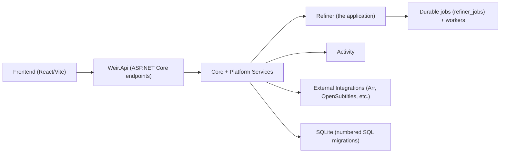
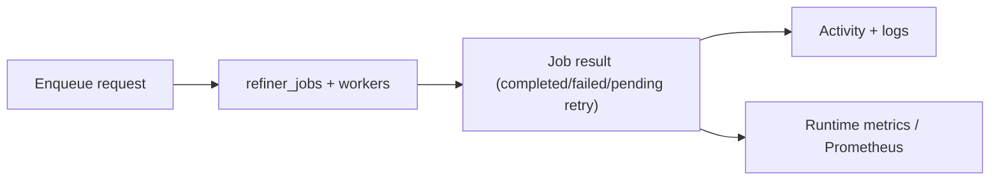

# Weir Architecture

This is the top-level map for agents and contributors. Deeper decisions live in [`docs/adr/`](docs/adr/).

## Product Shape

Weir is a self-hosted media operations app:

- **Refiner** remuxes watched media into cleaner outputs. It is configured as any number
  of **libraries** — each a row carrying its own paths, admission rules, schedule,
  guardrails and media manager connections — rather than one fixed movie scope and one
  fixed TV scope. A library's `media_type` (Movies or TV; named `media_scope` until #460)
  is a property of the library, not what the module partitions on. It still decides the
  cleanup shape, which manager queue is asked when a library links none, and which library a
  job belongs to when its payload names none. A hand-off from a manager lands in the library
  whose watched folder holds the file. Adding a library is a POST. See
  [ADR-0014](docs/adr/ADR-0014-refiner-libraries-replace-fixed-scopes.md). The singleton
  settings rows that libraries replaced were dropped in `0025`, and the scope-shaped
  `path-settings` and `remux-rules-settings` routes that outlived them were removed in #460.
- **Media managers** are the products Weir accepts work from and reports back to.
  A connection carries a *kind* (Radarr, Sonarr, Deluno, or anything posting Weir's
  own payload) rather than each product having its own routes and columns; every inbound
  event arrives at `POST /api/v1/intake/webhook/{source}`. See
  [ADR-0013](docs/adr/ADR-0013-media-managers-are-kinds-not-products.md).
  Outbound, a media scope resolves to **every** connection that looks after it and each
  one is asked what it is importing and which files it still keeps. "Could not ask" is a
  distinct answer from "nothing is importing", and only the latter clears a delete. See
  [ADR-0015](docs/adr/ADR-0015-media-manager-port-outbound.md).
- **Dashboard, Activity, and Settings** expose runtime health, history, logs, backups, upgrades, and security posture.

## Runtime Shape

- Server: C# / .NET 10 under `apps/server` (ASP.NET Core minimal APIs, SQLite through
  `Microsoft.Data.Sqlite` with explicit SQL and numbered SQL migrations). See
  [ADR-0017](docs/adr/ADR-0017-backend-on-dotnet.md).
- Frontend: React + Vite under `apps/web/src`, served by the server from `WEIR_WEB_DIST`.
- Packaging: a Docker image (linux/amd64 and linux/arm64) and a Windows Velopack installer whose
  .NET tray app (`apps/tray`) starts and watches the server.
- Runtime data: `WEIR_HOME`.

## Server Map

Solution `apps/server/Weir.slnx`; details in [`apps/server/README.md`](apps/server/README.md).

- `src/Weir.Host`: the process — configuration, logging, database startup, Kestrel, Windows Service and systemd support. Builds `Weir` / `Weir.exe`.
- `src/Weir.Api`: endpoints and HTTP behaviour — auth and CSRF, security headers, request ids, the OpenAPI document, serving the web app.
- `src/Weir.Infrastructure`: SQLite (connections, stores, numbered migrations in `Migrations/`), the durable job queue and workers, the remux pass, ffmpeg/ffprobe processes, media manager clients, the filesystem and log files.
- `src/Weir.Core`: records and rules with no IO — the Refiner rules engine, job rules, media manager rules, settings and security primitives.
- `tests/*`: xUnit tests per project. The language-neutral contract suite (`tests/contract`) and the E2E smoke (`tests/e2e/weir`) judge a running server from outside.
- `apps/tray/Weir.Tray`: the Windows tray app shipped in the installer.

## Frontend Map

- `src/app`: app-level router and providers.
- `src/layouts`: shell/navigation layout.
- `src/pages`: feature pages (In hand, Refiner, Activity, Settings, setup).
- `src/lib`: API clients, query hooks, typed data helpers, and UI helpers.
- `src/components`: reusable UI and brand components.
- `src/styles`: design tokens and shell styling.
- `src/test`: frontend test setup.

## Boundary Rules

- Refiner code should keep destructive or irreversible behavior behind explicit services and tests.
- Backend APIs should expose typed schemas at boundaries instead of inferred shapes.
- Frontend pages should use typed API/query helpers from `src/lib` rather than ad hoc fetch calls.
- Cross-cutting runtime concerns belong in shared services (`Weir.Core` rules, `Weir.Infrastructure` platform services), not inside Refiner implementation details.
- `Weir.Core` stays free of IO; filesystem, database, process and HTTP work lives in `Weir.Infrastructure` behind seams tests can replace.
- File lifecycle changes must preserve the safety contract in [`docs/file-lifecycle-contract.md`](docs/file-lifecycle-contract.md).

## Job Lifecycle

## Architecture Decision Records

Current ADR index: [`docs/adr/README.md`](docs/adr/README.md).

Add an ADR when a decision changes runtime storage, data safety, security boundaries, release mechanics, or packaging behavior.
