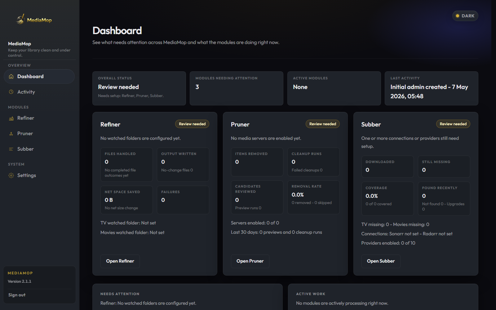
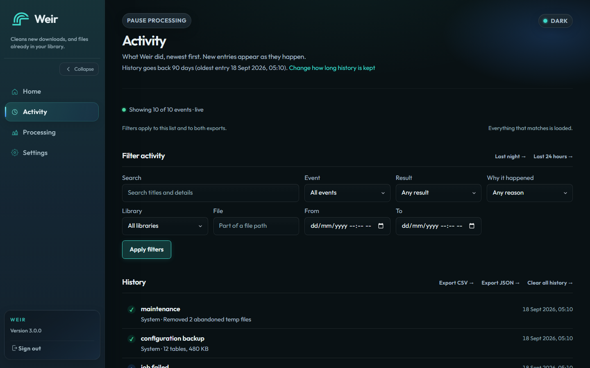
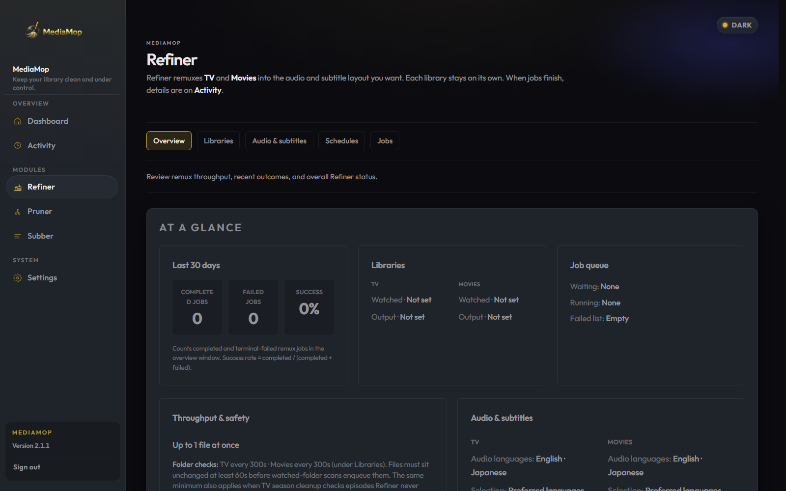
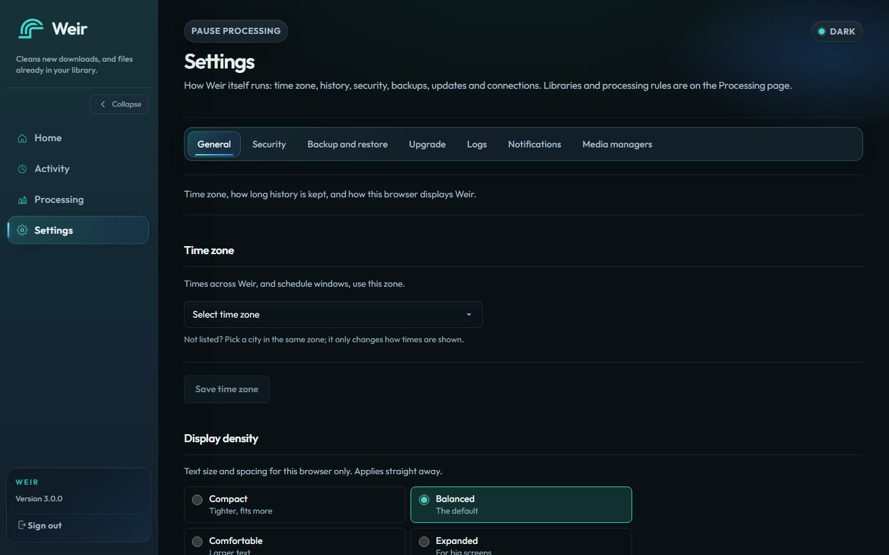
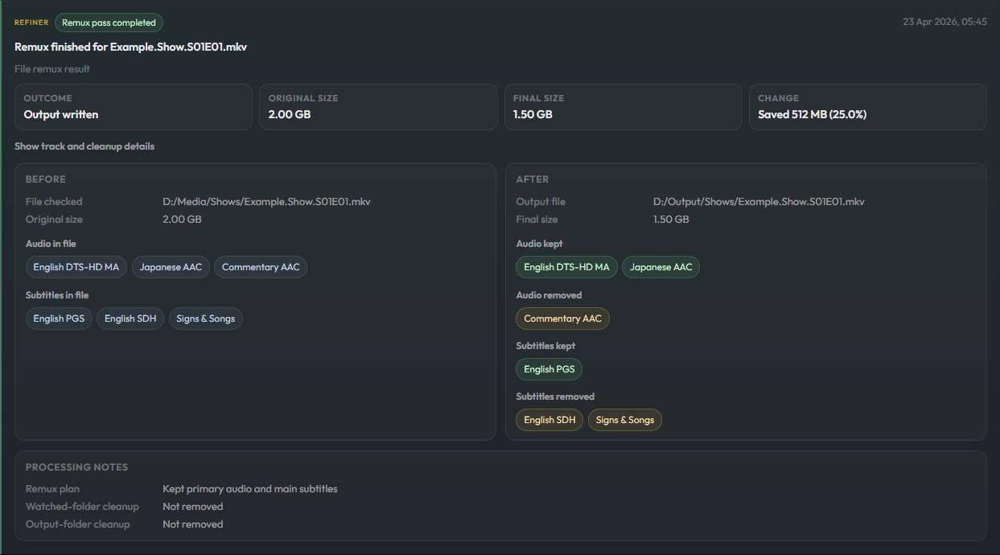

# Weir

<!-- README_LOCKED_SECTION_START: project-note -->
## A note on this project

Weir is a vibe-coded project.

I built it because I wanted a media workflow that matched the way I actually manage my library, and I could not find an existing tool that fit. I am not a software engineer and can't code and I have the upmost respect for the people that can.  So this started from a very practical place: solve the problems I kept running into and keep refining it until it worked the way I needed.

It is opinionated on purpose. Every module exists because it solved a real problem in my own setup first.

If it happens to fit the way you manage your library too, use it, improve it, and share those improvements under the same open license.

<!-- README_LOCKED_SECTION_END: project-note -->

## What Weir is

Weir is a self-hosted media operations app for people who want more control over how their library is processed and maintained.

It brings a few focused tools together in one place:

- **Refiner** cleans up media files by remuxing them into a cleaner, more consistent result.
- **In hand, Activity, and Settings** give you a live view of what Weir is holding, recent work, logs, and core app configuration.

The app ships as a C# / .NET 10 server with SQLite and a React + Vite web UI.

## Screenshots

| Dashboard | Activity |
| --- | --- |
|  |  |

| Refiner |
| --- |
|  |

| Settings |
| --- |
|  |

### Refiner activity detail



## Quick start

Prerequisites:

- .NET 10 SDK (the version is pinned in `apps/server/global.json`)
- Node.js 24 with `npm` on `PATH`

From the repository root:

1. Copy `.env.example` to `.env` and set `WEIR_SESSION_SECRET`. Set
   `WEIR_CREDENTIALS_SECRET` as a separate long random value before saving Sonarr or Radarr
   credentials. To rotate `WEIR_CREDENTIALS_SECRET`, put the old value in `WEIR_PREVIOUS_CREDENTIALS_SECRETS`,
   restart Weir, then re-save provider credentials so they are written with the new secret. Changing
   `WEIR_SESSION_SECRET` later can require re-entering credentials that were still encrypted with the old session
   secret.
2. Start the repo-local dev stack (the server creates its SQLite database on first start):

   ```powershell
   cd apps\web
   npm ci
   npm run dev
   ```

The default dev URL is `http://localhost:8782/`.

## Runtime notes

- SQLite runtime files live under `WEIR_HOME`; the server creates and migrates its database itself
- production deployments should expose one canonical HTTPS origin
- local development uses the Vite `/api` proxy; keep `VITE_API_BASE_URL` unset unless you know you need it

## License

Weir is licensed under the GNU Affero General Public License v3.0 or later (`AGPL-3.0-or-later`).

You can use, study, modify, and redistribute it under the license terms. If you distribute a modified version or run a modified version as a network service, the AGPL requires you to make the corresponding source code available under the same license.

## Support Weir

Weir is free to use. Support is optional.

If Weir saves you time or keeps your downloads clean, you can support ongoing development.

Set `VITE_SUPPORT_URL` in `apps/web/.env` or your deployment environment to show the in-app support button.

`VITE_SUPPORT_URL` is a Vite build-time variable. Set it before running `npm run build` or packaging a release. Changing it after the frontend has been built or after a Windows installer has been packaged does not update the installed UI until the frontend is rebuilt and repackaged.

Official GitHub releases should set the repository variable `VITE_SUPPORT_URL` to `https://github.com/sponsors/jampat000` so the packaged production frontend includes **Settings > Support**.

## Verification

Optional local verification:

```powershell
.\scripts\verify-local.ps1
```

Canonical ports: [`docs/ports.md`](docs/ports.md)

Full local development instructions: [`docs/local-development.md`](docs/local-development.md)

## Releases

Release instructions and artifact types: [`docs/release.md`](docs/release.md)

Current release outputs include:

- GitHub Release on `vX.Y.Z`
- `weir-web-dist.zip`
- `Weir-win-Setup.exe`
- Docker images on GHCR such as `ghcr.io/jampat000/weir:latest`

On Windows, `Weir-win-Setup.exe` installs the per-user .NET tray app under `%LocalAppData%\Weir`; it does not require administrator rights or a separate updater service. The tray app manages automatic Velopack updates, and upgrades can also be started from Settings.

If you are upgrading from v2.2.x or earlier, uninstall the legacy Weir application first, then run the current installer. Runtime data under `C:\ProgramData\Weir` is preserved, and the tray app removes the legacy updater service on first launch. See [`docs/release.md`](docs/release.md) for the current packaging and upgrade contract.

## Docker

Quick start:

```bash
docker pull ghcr.io/jampat000/weir:latest
docker run --rm -p 8788:8788 -v weir-data:/data/weir ghcr.io/jampat000/weir:latest
```

Or from a repo clone:

```bash
docker compose pull
docker compose up -d
```

No env file is required for the default Docker path. The container will generate and persist
its own session secret if you do not provide one.

Images are published for `linux/amd64` and `linux/arm64`. If you need the container to write as a
specific NAS or host user, set `WEIR_PUID` / `WEIR_PGID`. Full examples live in
[`docker/README.md`](docker/README.md).

Full Docker instructions: [`docker/README.md`](docker/README.md)
