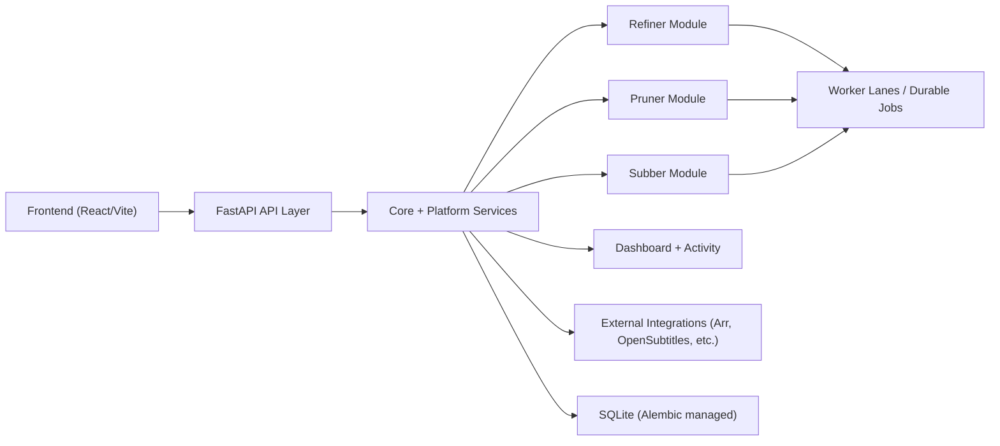
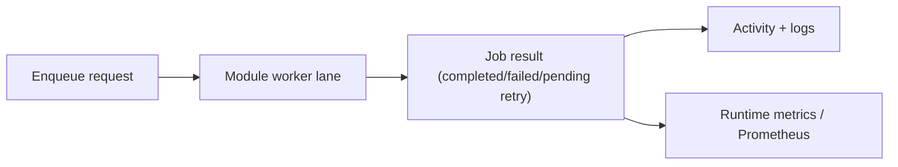

# Architecture Overview

MediaMop is a self-hosted media operations app with four main modules:

- **Refiner** — remuxes watched media into cleaner outputs
- **Pruner** — previews and removes media matching cleanup rules
- **Subber** — syncs Sonarr/Radarr libraries and manages subtitle coverage
- **Dashboard** — exposes runtime health, history, logs, backups, upgrades, and security posture

## Runtime shape

## Technology stack

| Layer | Technology |
|-------|-----------|
| Backend | Python / FastAPI / SQLite / Alembic |
| Frontend | React 19 / Vite / TailwindCSS / TanStack Query |
| Tray app | Python / pystray |
| Installer | Inno Setup 6 + PyInstaller |
| Packaging | Docker + Windows installer |

## Backend map

| Package | Responsibility |
|---------|---------------|
| `mediamop.api` | FastAPI app factory, router composition, request dependencies |
| `mediamop.core` | Config, runtime paths, database setup, lifespan, logging |
| `mediamop.platform` | Shared services: auth, activity, jobs, settings, observability |
| `mediamop.modules` | Module-owned domains for Refiner, Pruner, Subber, Dashboard |
| `mediamop.integrations` | External service integration code |
| `mediamop.windows` | Windows tray and package-specific helpers |

## Frontend map

| Directory | Responsibility |
|-----------|---------------|
| `src/app` | App-level router and providers |
| `src/layouts` | Shell/navigation layout |
| `src/pages` | Feature pages by module |
| `src/lib` | API clients, query hooks, typed data helpers |
| `src/components` | Reusable UI and brand components |

## Job lifecycle

## Deployment model

MediaMop 1.x supports a single-instance deployment:

- One application process
- One host or container
- One SQLite database writer
- Same-origin web app and API by default

Horizontal scaling is not supported. Worker counts control in-process job slots within the single process.

## Boundary rules

- Module code keeps destructive behavior behind explicit services and tests
- Backend APIs expose typed schemas at boundaries
- Frontend pages use typed API/query helpers from `src/lib`
- Cross-cutting concerns belong in `mediamop.platform` or `mediamop.core`
- File lifecycle changes must preserve the [safety contract](../guides/file-lifecycle)
