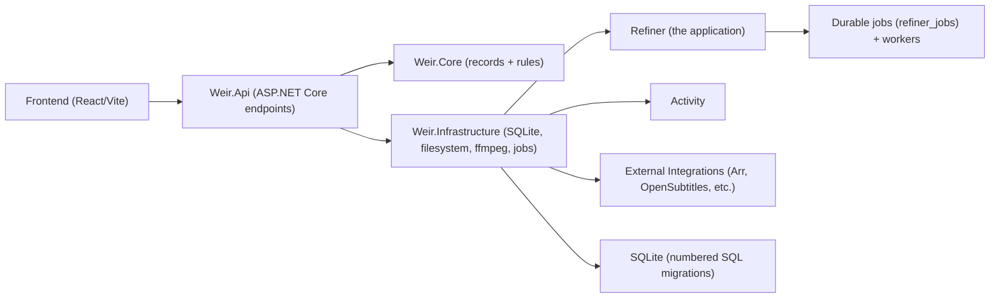
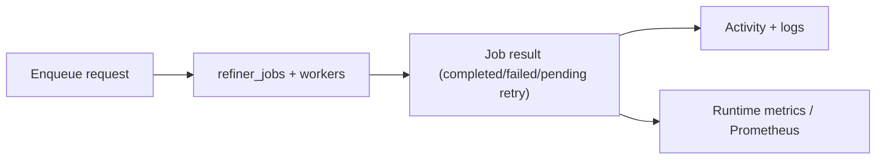

# Architecture Overview

Weir is a self-hosted media processing stage. Refiner is the application: it remuxes
watched media into cleaner outputs. Around it, the platform provides activity history, logs,
backups, upgrades, and security posture. The main screen, **In hand**, shows what Weir is
holding right now and anything that needs a person.

## Runtime shape

```mermaid
flowchart LR
  UI["Frontend (React/Vite)"] --> API["Weir.Api (ASP.NET Core endpoints)"]
  API --> Core["Weir.Core (records + rules)"]
  API --> Infra["Weir.Infrastructure (SQLite, filesystem, ffmpeg, jobs)"]
  Infra --> Refiner["Refiner (the application)"]
  Infra --> Activity["Activity"]
  Infra --> Integrations["External Integrations (Arr, OpenSubtitles, etc.)"]
  Infra --> DB["SQLite (numbered SQL migrations)"]
  Refiner --> Jobs["Durable jobs (refiner_jobs) + workers"]
```

## Technology stack

| Layer | Technology |
|-------|-----------|
| Backend | C# / .NET 10, ASP.NET Core minimal APIs, SQLite via Microsoft.Data.Sqlite with numbered SQL migrations |
| Frontend | React 19 / Vite / TailwindCSS / TanStack Query |
| Tray app | C# / .NET 9 WinForms tray |
| Installer | Velopack |
| Packaging | Docker (linux/amd64 + linux/arm64) + Windows installer |

## Server map

The server lives in `apps/server` (solution `Weir.slnx`).

| Project | Responsibility |
|---------|---------------|
| `src/Weir.Host` | The process itself: startup, configuration from `WEIR_*` variables, builds `Weir` / `Weir.exe` |
| `src/Weir.Api` | HTTP endpoints under `/api/v1`, request and response behaviour, OpenAPI document, serving the web app |
| `src/Weir.Infrastructure` | SQLite access with explicit SQL, numbered SQL migrations in `Migrations/`, filesystem work, the ffmpeg process runner, durable jobs and workers |
| `src/Weir.Core` | Records and rules only — no disk, network or database access |
| `tests/` | xUnit tests for each project |

The database schema is unchanged from the earlier Python backend. The server still records its
schema revision in the `alembic_version` table so it can open databases that backend created,
but the .NET migrations are now the only source of schema changes.

## Frontend map

| Directory | Responsibility |
|-----------|---------------|
| `src/app` | App-level router and providers |
| `src/layouts` | Shell/navigation layout |
| `src/pages` | Feature pages (In hand, Processing, Activity, Settings, setup) |
| `src/lib` | API clients, query hooks, typed data helpers |
| `src/components` | Reusable UI and brand components |

## Job lifecycle

```mermaid
flowchart LR
  Enqueue["Enqueue request"] --> Jobs["refiner_jobs + workers"]
  Jobs --> Result["Job result (completed/failed/pending retry)"]
  Result --> Activity["Activity + logs"]
  Result --> Metrics["Runtime metrics / Prometheus"]
```

New files are noticed two ways, and both end at the same job.

- **Straight away.** Each enabled library with a watched folder and "watch for changes" turned on gets
  its own recursive filesystem watcher. Events are debounced (`WEIR_REFINER_WATCHER_DEBOUNCE_SECONDS`,
  3 seconds by default) and then queue the ordinary watched-folder scan. Creating, editing or deleting a
  library takes effect without a restart, and if the operating system reports lost events the library is
  scanned in full and its watcher replaced. `WEIR_REFINER_WATCHER_ENABLED=0` turns the watchers off.
- **As a backstop.** Every library is scanned on its own timer anyway (`scan_interval_seconds`, five
  minutes by default), so a folder a watcher cannot see — a network share, a container mount that does
  not forward events — still gets picked up.

The watcher decides nothing about a file itself: extension checks, exclusions, size limits, the hold
timer and settling all stay in the scan handler that already owns them.

## Deployment model

Weir 1.x supports a single-instance deployment:

- One application process
- One host or container
- One SQLite database writer
- Same-origin web app and API by default

Horizontal scaling is not supported. Worker counts control in-process job slots within the single process.

## Boundary rules

- Refiner code keeps destructive behavior behind explicit services and tests
- Server APIs expose typed contracts at boundaries, described in the committed OpenAPI document
- Frontend pages use typed API/query helpers from `src/lib`
- Rules with no side effects belong in `Weir.Core`; anything that touches disk, database or processes belongs in `Weir.Infrastructure`
- File lifecycle changes must preserve the [safety contract](../guides/file-lifecycle)
